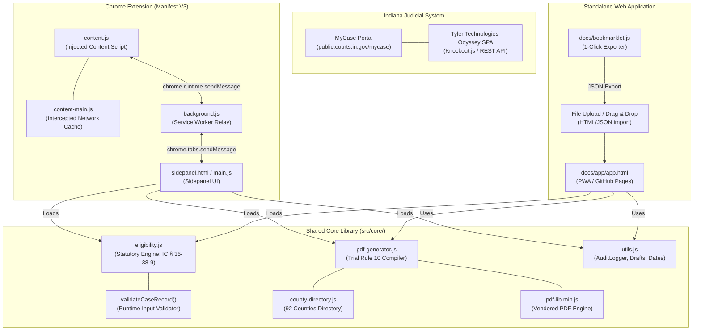
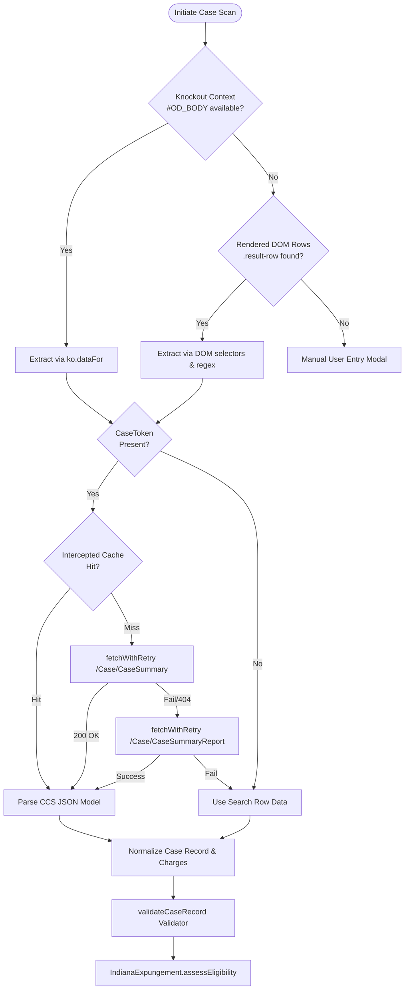

# Architecture of Indiana Expungement Assistant

The **Indiana Expungement Assistant** is a client-side civic legal technology application that scrapes court docket records from the Indiana Odyssey court portal (MyCase) and compiles court-ready expungement packets conforming to Indiana Trial Rule 10 and IC § 35-38-9.

---

## 1. High-Level Component Diagram

---

## 2. Dual-Tree Distribution Architecture

To serve users both inside the Chrome browser extension and on open web platforms (including mobile devices and Chromebooks), the project employs a **dual front-end build system**:

| Target | Entry Point | Execution Context | Storage Layer |
|---|---|---|---|
| **Chrome Extension** | `extension/sidepanel/sidepanel.html` | Chrome MV3 side panel alongside MyCase | `chrome.storage.local` + `sessionStorage` |
| **Web App (PWA)** | `docs/app/app.html` | Static GitHub Pages web application | `localStorage` + `sessionStorage` |

Both targets share identical ES6 core logic copied from `src/core/` via `scripts/build-core.js`.
Parity is strictly enforced by `scripts/check-parity.js` during every test run.

---

## 3. Scraper Pipeline & Fallback Chain

When extracting records from Indiana MyCase (`public.courts.in.gov/mycase`), the content script applies a multi-tier fallback extraction strategy:

---

## 4. Message Flow (Extension Communication)

In the Chrome extension:
1. **User triggers scan**: Sidepanel UI sends `SCAN_PAGE` message to `background.js`.
2. **Tab Routing**: `background.js` locates the active MyCase tab and relays the command to `content.js`.
3. **Execution**: `content.js` executes the scraper pipeline, gathers records, parses CCS dockets, and performs initial validation.
4. **Relay & Confirmation**: `content.js` sends `PAGE_RESULTS` back through the service worker to the sidepanel.
5. **Parity Confirmation**: The sidepanel opens the **Scraper Parity Modal**, allowing the user to review all scraped cases before committing them to state.

---

## 5. Privacy & Security Model

- **Client-Side Only**: The entire application runs in the user's browser thread. No servers, no tracking, and no external analytics exist.
- **Odyssey Credentials**: The extension utilizes the user's existing authenticated cookies on `public.courts.in.gov` via `credentials: 'same-origin'`. It never stores, prompts for, or handles court passwords.
- **Client Audit Trail**: All audit logs are maintained in browser `sessionStorage` and can be exported as a JSON manifest by the user. Nothing is phoned home.
